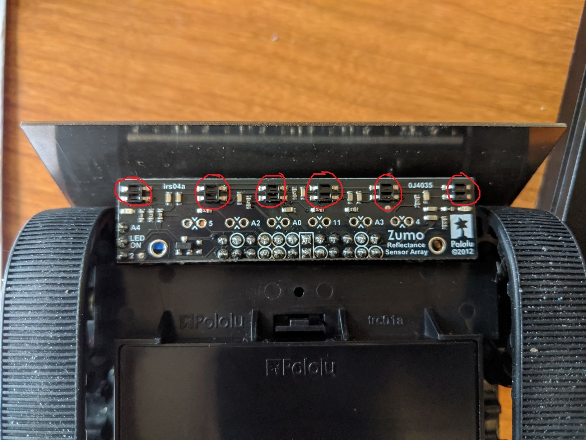

# Milestone 2

## Tutorial: Using the Zumo Line Sensor Array

The Zumo shield has an array of six short-range IR reflectance sensors under the front of the robot. 



### Initializing the Sensor Array

If you have installed the ZumoShield library (see video from first milestone) then you can go to `Sketch > Include Library`
and select `ZumoShield`.

Create an instance of the `ZumoReflectanceSensorArray` in your sketch like this:

```c++
#include <Wire.h>
#include <ZumoShield.h>

ZumoReflectanceSensorArray linesensors(QTR_NO_EMITTER_PIN);

void setup(){

}

void loop(){

}
```

Specifying `QTR_NO_EMITTER_PIN` sets the option that we do not want to actively turn the IR emitters on and off.
Instead they will be on by default the entire time.

### Reading data 

The data from the line sensor array can be accessed in a few different ways using the `ZumoShield` library.

#### Option 1: Line Location

The first option is to use the `readLine()` function from the library. This function aggregates the data across
the six sensors and returns a value from `0-5000` indicating the estimated location of the line. A value of `0`
indicates that the line is all the way to the left of the robot, a value of `5000` indicates that the line is 
all the way to the right of the robot, and a value of `2500` indicate that the line is centered under the robot.

In order to use the `readLine()` function you must first calibrate the line sensors. This is accomplished by
calling the `calibrate()` method and exposing each of the six sensors to the darkest and lightest values in
the environment. One way to accomplish this is to have the robot oscillate left-and-right for a few seconds
while repeatedly calling the calibrate function. 

```c++
void setup() {
  int i;
  int spin_direction = 1;
  motors.setSpeeds(80*spin_direction, -80*spin_direction);
  for(i = 0; i<250; i++){
    linesensors.calibrate();
    if(i%50 == 25){ // every 50 loops, starting on loop 25...
      spin_direction = -spin_direction;
      motors.setSpeeds(80*spin_direction, -80*spin_direction);
    }
    delay(20);
  }
  motors.setSpeeds(0,0);
  delay(500);
}
```
Once the line sensor is calibrated you can use `readLine()` to get the position of the line. This function
requires that you have an `unsigned int array` to store the line sensor data. In the example code below, I'm
using the ZumoBuzzer to play a tone that gets higher when the line is to the right. This is a nice method
for checking that it is working with using the `Serial` port (and thus tethering the robot to your computer).

*Imporant: You must connect the jumper for the buzzer before it will play sound. See this video for instructions.*

```c++
ZumoBuzzer buzzer; // create a buzzer to play sound
unsigned int sensor_vals[6];
void loop() {
  int line_position = linesensors.readLine(sensor_vals);
  int frequency = 220 + ((float)line_position / 5000) * 660;
  buzzer.playFrequency(frequency, 100, 15);
  while (buzzer.isPlaying());
}
```

The full code for this method is available in the `read_line_method` folder.

#### Option 2: Raw Data

You can also read the raw values for each sensor using the `read()` method. This method does not require any
calibration.

There's not an interesting way that I could think of to provide access to the values, so I use the normal
`Serial` port method for communicating with the Arduino.

```c++
#include <Wire.h>
#include <ZumoShield.h>

ZumoReflectanceSensorArray linesensors(QTR_NO_EMITTER_PIN);

void setup() {
  Serial.begin(9600);
}

unsigned int sensor_vals[6];
void loop() {
  linesensors.read(sensor_vals);
  Serial.print(sensor_vals[0]);
  Serial.print(" ");
  Serial.print(sensor_vals[1]);
  Serial.print(" ");
  Serial.print(sensor_vals[2]);
  Serial.print(" ");
  Serial.print(sensor_vals[3]);
  Serial.print(" ");
  Serial.print(sensor_vals[4]);
  Serial.print(" ");
  Serial.println(sensor_vals[5]);
  delay(50);
}
```

Notice that calling `read()` does not return any new values. Instead it updates the values of the `sensor_vals`
array. 

If you upload this code and open your serial monitor (making sure to set the Baud rate to 9600 in the bottom
corner of the serial monitor) you should see lines of numbers with 6 items per line. The values should range 
from 0 to 2000, with 2000 being when the sensor is directly over the line.

You could save yourself many lines of code in the `loop()` by using the `sprintf()` function. If you want
to adapt the code you can Google `sprintf` to learn how to use it.

This code is also available in the `raw_data_method` folder.


