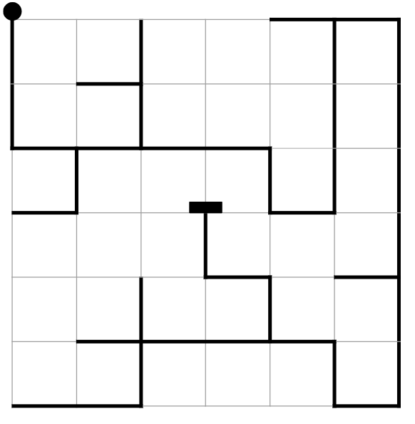
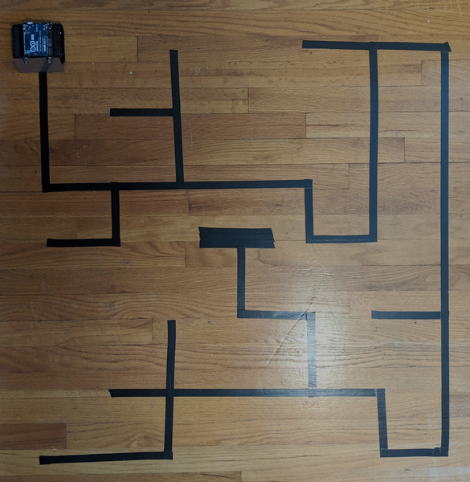

# Milestone 5

## Maze Layout

Here's the maze layout for the competition. You'll need a 36" x 36" space. Lines are spaced on a 6" grid. Do your best to get the center
of the tape on the grid, but perfection isn't necessary here. The start position is marked with the circle (you don't need to create a circle with tape). The end position is a solid rectangle. You do need to create this. It should be wider than the width of the robot and three pieces
of tape tall.



Here's what it looks like IRL.



My rendition isn't perfect, but it works OK. I have noticed that imprecise corners can make debugging harder, so take care when you are joining two pieces of tape together to get the edges aligned as best as you can.


## Solving a maze: left-hand-on-the-wall

One strategy for solving the maze is to always follow the left (or right) wall. If there are no loops in the maze then you are guaranteed to find the exit. To use this strategy the robot should always turn left whenever possible. 

## Detecting intersection types

In order to use the left-hand-on-the-wall strategy you'll probably want to be able to detect the different kinds of intersections that the robot arrives at. A lot of my coding effort to solve this Milestone went into a reliable algorithm for detecting different kinds of intersections. The full code is available in the code file above, but here are some hints without revealing my full solution. You can look at my code if you want the full solution.

1. I wrote a function called `get_intersection_type()` that returned an `int` corresponding to different kinds of intersections. I declared the different kinds of intersections as global variables:

```c++
int INTERSECTION_LEFT_TURN = 0;
int INTERSECTION_RIGHT_TURN = 1;
int INTERSECTION_T = 2;
int INTERSECTION_CROSS = 3;
int INTERSECTION_LEFT_T = 4;
int INTERSECTION_RIGHT_T = 5;
int FINISH = 6;
int NO_INTERSECTION = 7;
```

I found this to be helpful for organizing my code and for thinking clearly about what actions to take.

2. In the previous milestone with only a single path, the robot could treat the immediate detection of a line to the left or right as a signal about which way to turn. That won't work here, because you will want to turn right for an `INTERSECTION_RIGHT_TURN` but not for an `INTERSECTION_RIGHT_T`. In the second case, following the left wall dictates going forward through the intersection. My solution was to have the robot drive through the intersection in the `get_intersection_type()` function, keeping track of whether there were lines on the left and right, and also whether the straight line continued after the intersection. Once these three variables are known, you can determine which kind of intersection was seen.

3. You'll need a special case for the `FINISH`. Here the lines on the left and right of the robot are much thicker, so the robot will detect them for longer. In my `get_intersection_type()` function I implemented a counter so that if the robot was taking longer-than-usual to get to the end of the intersection it would `return FINISH;`.

4. You'll also need a special case for U-TURNS. I put this outside the `get_intersection_type()` function because I triggered the `get_intersection_type()` whenever a line was detected to the left or right of the path.

5. You'll probably need to rethink how the turning behavior should work. I was able to implement a fully *reactive* behavior for turning that worked well, but it took a lot of debugging! Think about how you can utilize the line sensor values to detect when the robot should stop turning. The general pattern looks something like this:

```c++
void turn_left(){
  motors.setSpeeds( , ); // set left turn
  while(   ) { // check for some condition in the line sensors
    linesensors.read(sensor_vals); // update sensor vals
  } // repeat this until condition is met, robot will continue turning based on last .setSpeeds command
}
```

You might benefit from consecutive `while` loops...

## Debugging Tips

Getting this working took a lot of debugging work. Here are some tips from my ~~suffering~~ effort.

1. Use the `ZumoBuzzer`. Playing different sounds at different points in the code can be really useful. The `.play()` method is easy to insert just about anywhere. 

```c++
buzzer.play("O6c32d32e32"); // plays three rising notes (c, d, e) at 32nd note duration in octave 6.
```

Documentation for the play method is [here](https://www.pololu.com/docs/0J18/3). Scroll down to `OrganutanBuzzer::play(const char* sequence)` for information about how to control the note sequence.

2. Test individual behaviors by halting the robot at the end of the behavior. With the robot moving quickly and the complexity of the code growing, I found it hard to tell which behavior was faulty at several points during debugging. I added a stop command followed by an infinite loop to the code at key places to help me isolate individual behaviors. For example, when the robot uses `turn_left()` does it finish the behavior oriented over the line correctly? Having the robot halt at the end of turning was very useful.

```c++
void turn_left(){
  motors.setSpeeds( , ); 
  while(   ) { 
    linesensors.read(sensor_vals); 
  } 
  motors.setSpeeds(0,0); // stop
  while(1) { } // infinite loop to prevent other behaviors from taking over again.
}
```

3. Take a video so you can replay runs and diagnose issues without needing to reset the robot repeatedly.

## Solving the Maze

Here's the robot solving the maze. It keeps track of all the turns it made and plays a tune at the end where each turn-type is a different kind of note.

[](https://youtu.be/LPltk54D-Rw)


