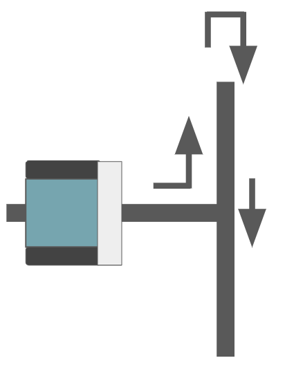
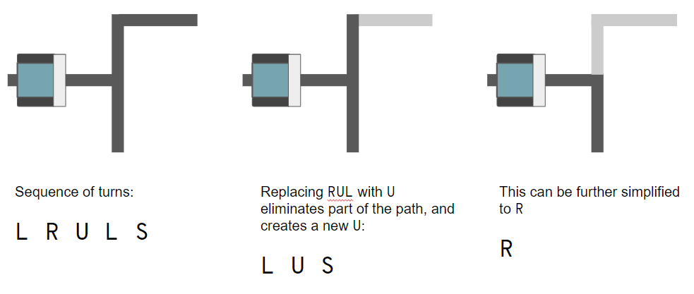

# Milestone 6

## Path Solving

The solution for Milestone 5 includes keeping track of the path the robot takes through all intersections that it encounters. This path is stored in an array, with each direction represented by a character:

* `L` for left
* `R` for right
* `U` for u-turn
* `S` for straight

The final path through the maze, if you use the left-hand-on-the-wall strategy looks like this:

`LSLLULUSLRLLLUSRSRRLSLRULLULULLLR`

A key part of the task for this week is to take this solution and reduce it down to the simplest path. One way to approach this is to recursively remove any U-turns in the path and replace them with the direction that the robot should have gone to avoid the U-turn. For example, at a T intersection like the one below the robot will follow the path `LUS` if using the left-hand-on-the-wall strategy. That three turn sequence could be replaced with `R`. 



Each possible three-item sequence with a `U` in the middle can be reduced to a single direction that avoids the U-turn. You could enumerate all possible three-item sequences, like `LUS = R` and `LUL = S`. Another idea is to keep track of the total rotation of the robot. `LUS` is `270 + 180 + 0` degrees of rotation. If you add that together and `%` by 360, you get `90`, which is `R`. Similarly, `LUL` is `270 + 180 + 270` which is `720`. `720 % 360 = 0` which is `S`.

What about when the robot needs to backtrack through a long path after taking a `U`? Recursively applying the algorithm above still works!



### Implementing in Code

Implementing the algorithm described above in Arduino C++ is a little trickier than doing it in a fully-featured modern language. I'm sure there are better solutions than what I came up with, but here's the strategy I eventually settled on:

1. Write a function that takes the completed path array and iterates through the array to find the first instance of a `U`. Once it find that `U` it replaces the three item sequence `xUy` with the new direction.
2. It then moves all the remaining items in the array up two spots.

Through these first two steps, it would work like this:

`LLLULUSL...` -> `LLSUSL...`

3. Keep track of how long the path is. Since arrays are fixed-length in c++, you need a separate variable to keep track of how many actual turns there are. There will be extra data at the end of the array that is *junk data*, unless you do something fancier to delete it.
4. If the function made a swap, call the function again. If it didn't make a swap, then the path has no U-turns and it is done.

## Using the path reducer

To use the path reducer, I called my `path_reduce()` function when the robot finds the goal the first time through the maze.

I then used the push button (right next to the start switch) to control the restart of the robot. You can use the button like this:

```c++
Pushbutton button(ZUMO_BUTTON); // declared at top of file

void setup(){ 
  ... stuff here ...
}

void loop(){
  ... stuff here ...
}

function solved(){
  ... some stuff here, too ...
  
  // find the simplest path
  reduce_path()

  button.waitForButton(); // built-in function that will pause the code until you press the button

  // during this time you reset the robot to the start position.

  run_solved_maze(); // run through the maze again, but this time you know what turns to take each time!
}
```

## Running the solved maze

Running the solved maze can use nearly the same code as you used for the learning phase, except that you'll want to change the left-hand-on-the-wall strategy for picking turns to a follow-the-known-path strategy.

Following the known path does allow for some optimization if you want to do it. For example, the robot doesn't need to drive throuh each intersection to figure out what kind of intersection it is. You already know what turn to take so you can program the robot to take the action as soon as it detects the turn. One thing to remember is that if you do this you may have to change your turn behaviors because you are initiating the action from a different position relative to the lines on the floor.

## Solved!

[](https://youtu.be/FfUvKNzYfrI)


